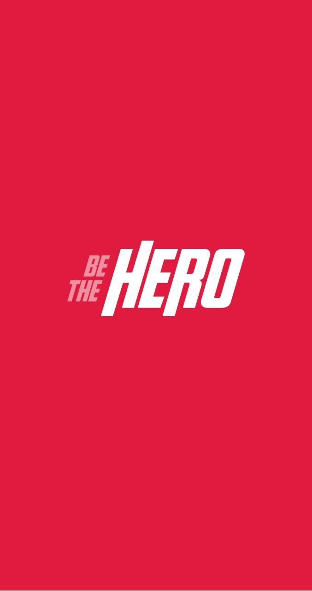
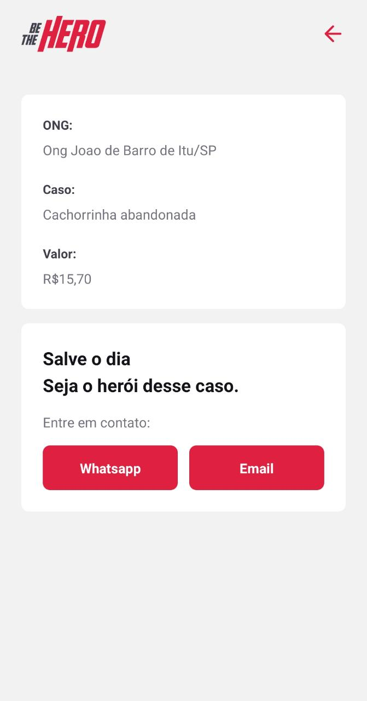

<h1 align="center">
Be the Hero
</h1>
<h2 align="center">
App Preview 
</h2>  

  
  
  

  

  
	
  

  

  

  

  <a href="#rocket-Technologies">Technologies</a>&nbsp;&nbsp;&nbsp;|&nbsp;&nbsp;&nbsp;
  <a href="#-project">Project</a>&nbsp;&nbsp;&nbsp;|&nbsp;&nbsp;&nbsp;
  <a href="#-layout">Layout</a>&nbsp;&nbsp;&nbsp;|&nbsp;&nbsp;&nbsp;
  <a href="#-how-to-contribute">How to contribute</a>&nbsp;&nbsp;&nbsp;|&nbsp;&nbsp;&nbsp;
  <a href="#memo-license">License</a>

 

## :rocket: Technologies

This project was developed with the following technologies:

- [Node.js](https://nodejs.org/en/) 
- [React Native](https://reactnative.dev/)

## 💻 Project

Be The Hero is a project developed during Omnistack week given by [Rockeseat](https://rocketseat.com.br/), that aims to connect people who are willing to help ONGs.

## 🔖 Layout

Access the layout here: [Figma](https://www.figma.com/file/2C2yvw7jsCOGmaNUDftX9n/Be-The-Hero---OmniStack-11?node-id=0%3A1).

## 🤔 How to contribute

- Make a fork;
- Create a branck with your feature: `git checkout -b my-feature`;
- Commit changes: `git commit -m 'feat: My new feature'`;
- Make a push to your branch: `git push origin my-feature`.

After merging your receipt request to done, you can delete a branch from yours.

## :memo: License

This project is under the MIT license. See the [LICENSE](LICENSE.md) for details.

---

Made by André Macena :wave: [Get in touch!](https://www.linkedin.com/in/andr%C3%A9-macena-15275b12b/)